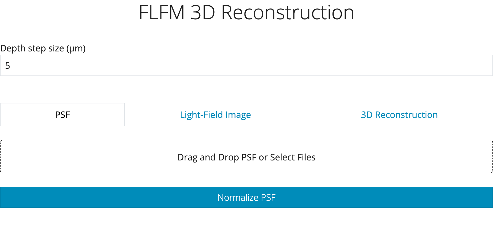
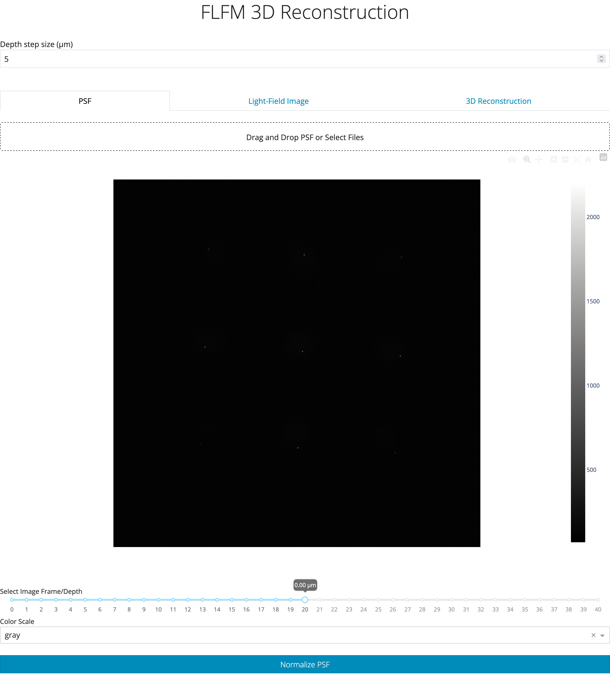
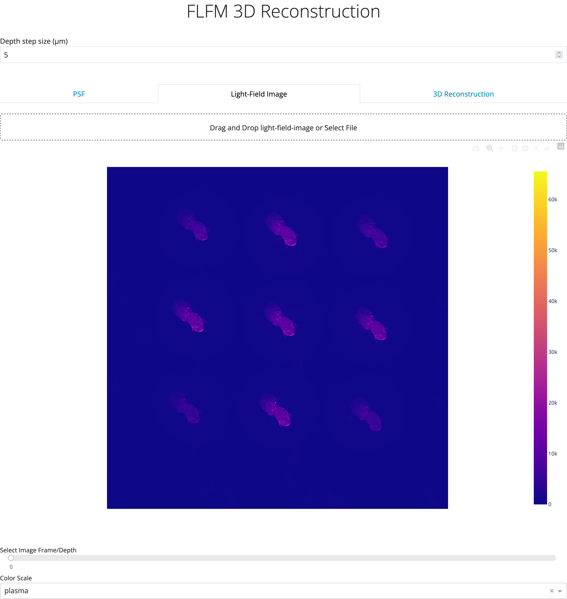
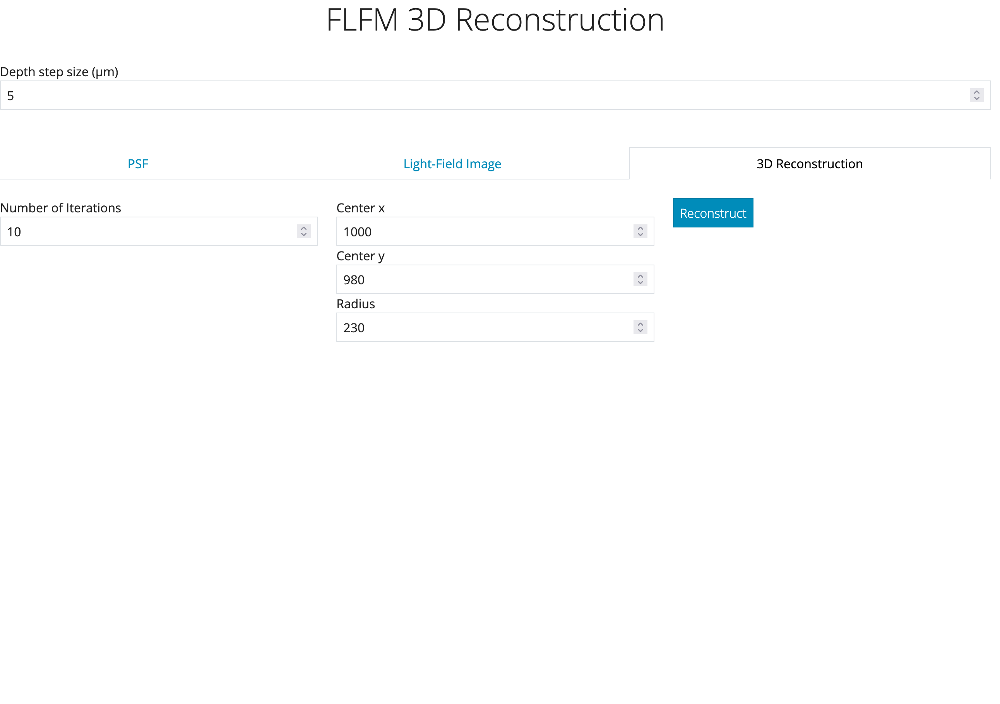
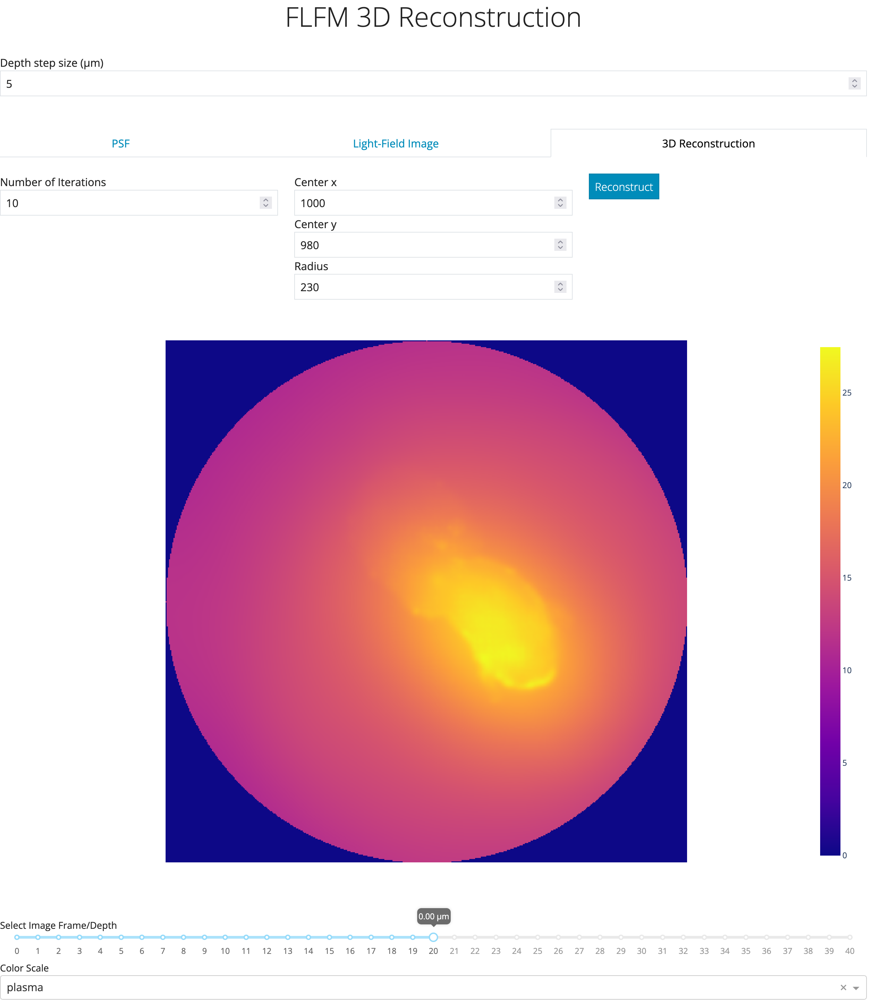

GUI User Manual
===============

The FLFM GUI is a simple Python/Dash application to view and reconstruct FLFM images.

For instructions on how to start the application see :ref:`usage_gui`.

The following landing page will be shown upon opening the app in your browser.

From here the three main tabs: ``PSF``, ``Light-Field-Image``, and ``3D Reconstruction`` are present. Clicking on any of
these tabs will display their corresponding view. Both the ``PSF`` and ``Light-Field-Image`` tabs are used to load
the relevant files to be reconstructed.

Image files can be loaded by either selecting or by dragging and dropping them to the load section of the page. Upon
doing so the image will be displayed, e.g.:

If the PSF has not already been normalized, click on the ``Normalize PSF`` button to do so.

.. note:: The PSF **must** be normalized for the final 3D reconstruction to be numerically accurate.

.. note:: The ``Normalize PSF`` feature can only be used once per uploaded PSF. The button is disabled once used for
    a given PSF. Re-uploading a PSF will re-enable the button.

Additional features are available such as selecting the colorscale, and more importantly the specific frame/depth to display
from a multi image TIFF.

The light-field image to process can be uploaded in exactly the same manner via the ``Light-Field-Image`` tab resulting in something similar
to the following.

.. note:: The default colorscale is ``grey``, however, ``plasma`` was selected for the above image.

Once both of these input files have been loaded you can select the ``3D Reconstruction`` tab which will look like the following:

There are a range of parameters that can be adjusted from this tab. The most important are the ``Depth step size``, and the center and radius
parameters in which the final image will be circularly cropped by. These parameters will be completely dependent on your
physical and optical setup. The default values can be changed either by editing the ``flfm/settings.py`` file or by using
environmental variables before starting the Dash app, e.g., ``FLFM_APP_DEPTH_STEP_SIZE=2``, or ``FLFM_DEFAULT_RADIUS=200``.

.. note:: Some env vars have different prefixes, either ``FLFLM_`` or ``FLFM_APP_``. Check
    :ref:`flfm.settings` to determine which is needed depending on whether the setting parameter belongs to the
    ``Settings`` or ``AppSettings`` class.

Finally clicking on the ``Reconstruct`` button will run the reconstruction algorithm resulting in something similar to the following.

.. note:: If the Dash application is hosted on hardware with GPU support and the ``flfm`` package was correctly installed for GPU support - the
    reconstruction should be sub-second. However, if running only a CPU, expect it to take 5-10s.

